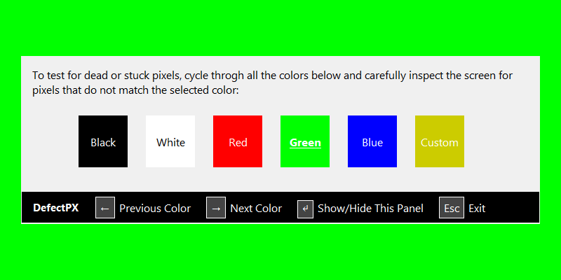

# DefectPX

**Note:** DefectPX is a legacy application. It was released in 2008 and has been superseded by [InjuredPixels](https://www.aurelitec.com/injuredpixels).

[DefectPX](https://www.aurelitec.com/defectpx/) allows you to easily check for dead or defective pixels on LCD monitors. You can use it to test a new LCD monitor before purchasing, or an already purchased monitor during the warranty period (you may get a replacement according to the manufacturer's dead pixel policy).

A defective (dead or stuck) pixel is a pixel that does not illuminate properly or does not display the correct color output. It usually looks like an annoying black, white or colored spot on your screen.

DefectPX fills the entire screen with one of the colors that make up a pixel, allowing you to inspect the screen for pixels that do not match the selected color. DefectPX is easy to use and it has a very intuitive interface.

DefectPX can be run directly without having to install it on your computer: just download and run.

## Reviews

### [Softpedia](https://www.softpedia.com/get/Desktop-Enhancements/Other-Desktop-Enhancements/DefectPX.shtml)

> "A small but very useful application which allows you to easily check for dead or defective pixels on LCD monitors."

### [List of Freeware](https://listoffreeware.com/free-dead-pixel-test-software-windows/)

> "DefectPX is another simple application to find a dead pixel. Simply launch the application and click anywhere on the screen to change the color." *(Nishant Gola, Author)*

### [Technix Update](https://www.technixupdate.com/defectpx-find-detect-and-fix-dead-pixel-on-lcd-monitor/)

> "This small tool is completely portable and does not require any installation, so just run the program; optionally you can also download the installer which lets you install this program like any other software."

[More Reviews](REVIEWS.md)

## Download

The latest stable version of DefectPX can be downloaded from [GitHub Releases](https://github.com/aurelitec/defectpx/releases). You can download a fully portable edition that does not require installation. DefectPX runs on Windows 10, 8, 7, Vista, and XP.

## Source Code

The HTA (HTML Application) edition of DefectPX is written using Visual Studio Code, but any text editor will do.

## Contributions

Contributions are welcome: code, documentation, graphics, design suggestions, and more. Please fork this repository and contribute back using [pull requests](https://github.com/aurelitec/defectpx/pulls). For feature requests and bug reports please [submit an issue](https://github.com/aurelitec/defectpx/issues).

## Sponsor

DefectPX (and all Aurelitec free applications) are supported by [East-Tec](http://www.east-tec.com), the home of [east-tec Eraser](http://www.east-tec.com/eraser/), the privacy tool that quickly and securely covers your online and PC tracks.

## License

DefectPX is licensed under the [MIT license](LICENSE).

## Author
  
https://github.com/helloworldwriter
